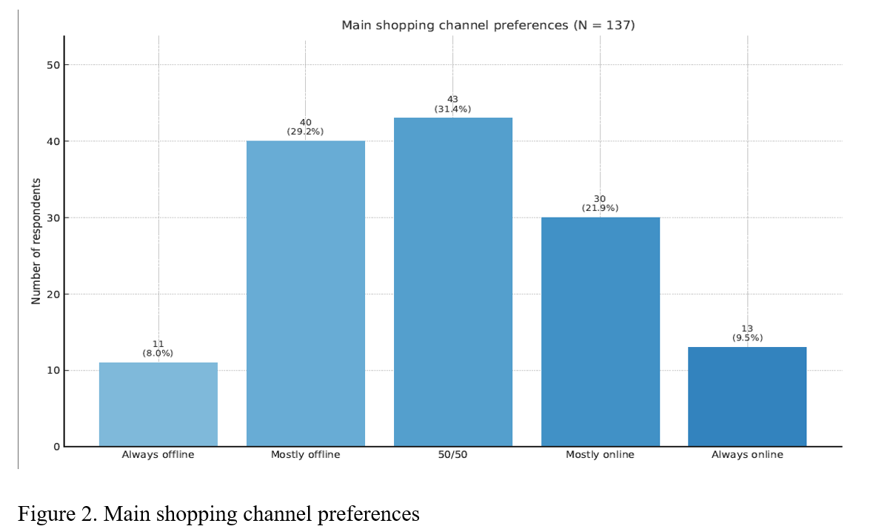
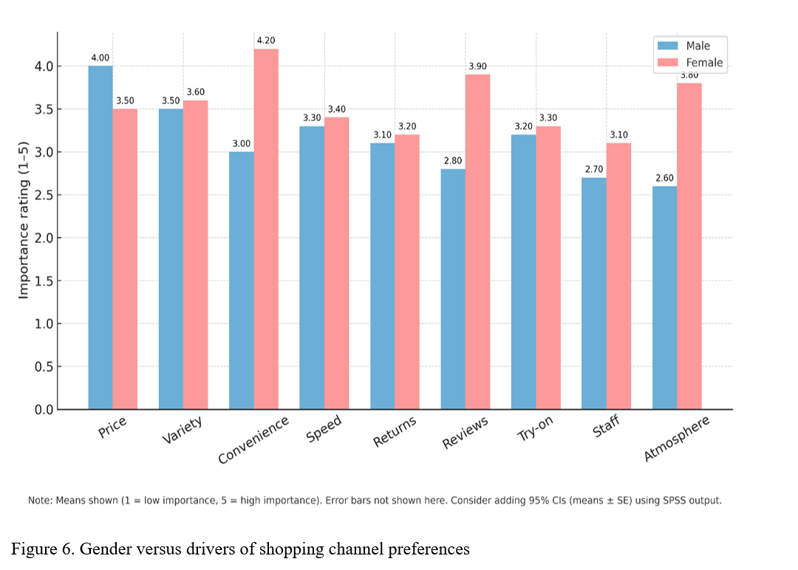
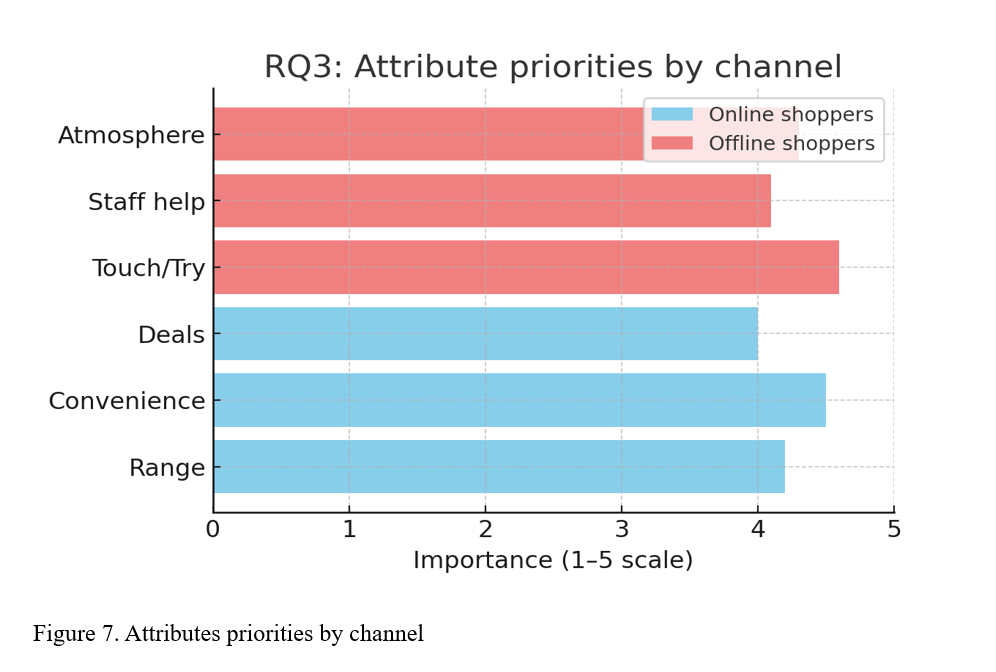

# Consumer Shopping Behaviour Insights

## Business Problem

How have UK consumers changed their online and offline fashion shopping behaviour after COVID-19?

## Dataset

137 UK respondents collected through Qualtrics.

## Tools Used

- SPSS
- Excel
- Qualtrics
- Statistical Modelling

## Methods

- Correlation Analysis
- Independent Samples T-Test
- Repeated Measures ANOVA
- Linear Regression
- Binary & Multinomial Logistic Regression

## Key Findings

- Omnichannel shopping is the dominant behaviour.
- Sustainability attitudes increase preference for offline shopping.
- Women value convenience and reviews more highly.
- Men prioritise price.
- Generation differences were less significant than expected.

## Business Impact

Provides actionable recommendations for fashion retailers on customer segmentation, omnichannel strategy and sustainability positioning.

## Key Visual Insights

### Shopping Channel Preferences

### Gender Differences in Shopping Drivers

## Recommendations

- Prioritise omnichannel retail strategies as most consumers use both online and offline channels.
- Strengthen sustainability messaging in physical stores to appeal to environmentally conscious consumers.
- Tailor marketing campaigns by gender-specific shopping motivations.
- Improve online review visibility and convenience-focused features.
- Use customer segmentation to personalise shopping experiences.

### Channel Attribute Priorities

